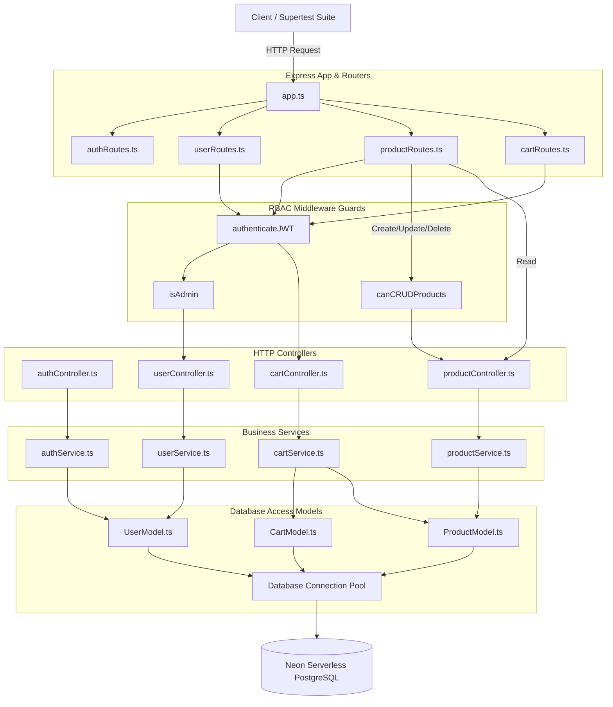

# 🛍️ Obsidian Luxe E-Commerce Backend Engine

Welcome to the **Obsidian Luxe Backend Engine**—a robust, production-grade Express + Node.js + TypeScript service layer built for high-performance e-commerce product catalog operations and shopping cart management.

---

## 👔 CTO Executive Briefing & Architectural Recap

This briefing highlights the backend's core design patterns, database configurations, and operational flow developed for the storefront UI.

### 1. Architectural Paradigm
The backend is structured under a strict **Controller-Service-Model (CSM)** architecture:
*   **Controller Layer (`src/controllers/`)**: Thin HTTP handlers parsing requests, enforcing contract inputs, and responding with precise payloads.
*   **Service Layer (`src/services/`)**: Centralized business logic nodes containing all calculations, transactional operations, and security validation routines.
*   **Model Layer (`src/models/`)**: Decoupled database interfaces using parameterized SQL queries with `pg` pools, isolating query logic from business execution.

### 2. Session Validation & Security Guardrails
User session management is built on stateless **JWT Token Handshakes** passing through robust middleware filters:
*   **Token Verification (`authenticateJWT`)**: Intercepts request headers, parses the `Authorization: Bearer <token>` token, decrypts it using a secure HMAC SHA-256 algorithm, and attaches the active session profile (`req.user`) to the pipeline context.
*   **Role Validation (`isAdmin`)**: Strict guard blocking administrative routes (e.g. user registries, permission panels) unless `req.user.role === 'admin'`.
*   **Permission Verification (`canCRUDProducts`)**: Unified security validator governing catalog changes (Create, Update, Delete). It grants permission if the session satisfies `req.user.role === 'admin' OR req.user.permission_to_crud === true`.

### 3. Dynamic Access & Permission Controls
To delegate store operations without exposing root administration credentials:
*   **Granting Operator Rights**: Administrators utilize the `PUT /api/users/:id/permission` endpoint to toggle a user's `permission_to_crud` flag in the PostgreSQL database.
*   **Database Constraints**: The PostgreSQL schema restricts these rights at the structural level. Columns default to `false` for standard profiles and enforce non-null states.
*   **Cascading Integrity**: System cart operations map foreign key relations matching user profiles and catalog products, configured with `ON DELETE CASCADE` triggers to guarantee database consistency when products or profiles are terminated.

### 4. API Core Endpoints Utilized by the Client

*   **Auth Module**:
    *   `POST /api/auth/signup`: Registers profiles and returns signed JWT keys.
    *   `POST /api/auth/login`: Verifies passwords using `bcryptjs` and grants active sessions.
*   **Catalog Module**:
    *   `GET /api/products`: Retrieves complete e-commerce product listings.
    *   `PUT /api/products/:id`: Updates e-commerce product stock, prices, and name properties.
    *   `DELETE /api/products/:id`: Purges e-commerce products from database registry.
*   **Cart Module**:
    *   `GET /api/cart`: Computes total cost, VAT (8%), shipping costs, and item quantities dynamically.
    *   `POST /api/cart`: Appends items to the active cart.
    *   `PUT /api/cart/:productId`: Alters item quantities under stock level limits.
    *   `DELETE /api/cart/:productId`: Purges item allocations.
    *   `DELETE /api/cart`: Clears entire cart upon checkout completion.
*   **User/Admin Control Panel**:
    *   `GET /api/users`: Interrogates user registries.
    *   `PUT /api/users/:id/permission`: Authorizes or restricts CRUD permissions.
    *   `DELETE /api/users/:id`: Revokes user logins and purges active sessions.

---

## 🏗️ Architectural System Blueprint

The diagram below represents the exact operational dataflow and security validation chains of the backend:



---

## 🏁 Operations & Local Deployment Manual

### 1. Local Environment Configuration
Establish a `.env` file in the root workspace of the project with your database string:
```env
PORT=5000
DATABASE_URL=postgres://<username>:<password>@<host>/neondb?sslmode=require
JWT_SECRET=super_secret_jwt_passphrase_key
JWT_EXPIRES_IN=24h
NODE_ENV=development
```

### 2. Dependency Resolution
Install production-grade libraries and typescript compilers:
```bash
npm install
```

### 3. Dynamic Database Seeding
Execute our Faker-fueled seed routine to safely stand up database schema tables and seed over 10+ randomized users and 20+ realistic e-commerce products in Neon PostgreSQL:
```bash
npm run seed
```
> 🔒 **Admin Seed Directives**:
> *   **Email**: `pageadmin@gmail.com`
> *   **Password**: `admin123`

### 4. Running the Dev Server
Launch live hot-reloading compilers for real-time testing:
```bash
npm run dev
```

### 5. Triggering E2E Integration Suite
Verify security middleware interceptors, cart validations, stock limits, and role access control under Supertest:
```bash
npm run test
```

### 6. Document Generation
Inspect active router stacks and auto-generate this system manual programmatically:
```bash
npm run docs
```

---

## 🚦 Programmatic Active Route Registry

### 🏁 Global Base URL
`http://localhost:5000`

### 🚦 Active Endpoint Summary

| Method | Endpoint | Security / Middlewares | Description |
| :--- | :--- | :--- | :--- |
| **POST** | `/api/auth/login` | `Public` | Validates user credentials and generates a new JWT session token. |
| **POST** | `/api/auth/signup` | `Public` | Registers a new user account, encrypts password using bcryptjs, and issues a cryptographically signed JWT session token. |
| **DELETE** | `/api/cart` | `authenticateJWT` | Empties the user's shopping cart completely. |
| **GET** | `/api/cart` | `authenticateJWT` | Retrieves the authenticated user's shopping cart. |
| **POST** | `/api/cart` | `authenticateJWT` | Adds a product e-commerce item to the user's shopping cart. |
| **DELETE** | `/api/cart/:productId` | `authenticateJWT` | Removes a specific product from the user's cart. |
| **PUT** | `/api/cart/:productId` | `authenticateJWT` | Directly updates the quantity of an item in the user's cart. |
| **GET** | `/api/products` | `authenticateJWT` | Retrieve a complete list of all premium luxury e-commerce products currently in the catalog. |
| **POST** | `/api/products` | `authenticateJWT`, `canCRUDProducts` | Registers a new premium luxury tech product in the database. |
| **DELETE** | `/api/products/:id` | `authenticateJWT`, `canCRUDProducts` | Deletes a product listing completely from the catalog. |
| **GET** | `/api/products/:id` | `authenticateJWT` | Retrieve specific details of an e-commerce product listing by its unique ID. |
| **PUT** | `/api/products/:id` | `authenticateJWT`, `canCRUDProducts` | Updates attributes of an existing product listing. |
| **GET** | `/api/users` | `authenticateJWT`, `isAdmin` | Retrieve a list of all registered users. |
| **DELETE** | `/api/users/:id` | `authenticateJWT`, `isAdmin` | Deletes a specific user by ID from the database. |
| **PUT** | `/api/users/:id/permission` | `authenticateJWT`, `isAdmin` | Enables an administrator to grant or revoke e-commerce product CRUD authorization to a normal user. |
| **GET** | `/health` | `Public` | No description provided. |

---

### 🛠️ Detailed Endpoint Reference

#### ➡️ POST `/api/auth/login`

**Description**:
Validates user credentials and generates a new JWT session token.

**Security & Guards**:
*   🔓 **Public Endpoint** (No authentication required)

**Expected Request Body** (`application/json`):
```json
{
  "email": "string (Required)",
  "password": "string (Required)"
}
```

**Example Success Response** (`200/201 Success`):
```json
{
  "message": "Login successful",
  "token": "JWT_TOKEN_STRING",
  "user": {
    "id": 1,
    "name": "anil",
    "email": "pageadmin@gmail.com",
    "role": "admin",
    "permission_to_crud": true,
    "created_at": "TIMESTAMP"
  }
}
```

---

#### ➡️ POST `/api/auth/signup`

**Description**:
Registers a new user account, encrypts password using bcryptjs, and issues a cryptographically signed JWT session token. Default role is "user" with CRUD permissions set to false.

**Security & Guards**:
*   🔓 **Public Endpoint** (No authentication required)

**Expected Request Body** (`application/json`):
```json
{
  "name": "string (Required)",
  "email": "string (Required, Unique)",
  "password": "string (Required)"
}
```

**Example Success Response** (`200/201 Success`):
```json
{
  "message": "User registered successfully",
  "token": "JWT_TOKEN_STRING",
  "user": {
    "id": 2,
    "name": "Jane Doe",
    "email": "jane@example.com",
    "role": "user",
    "permission_to_crud": false,
    "created_at": "TIMESTAMP"
  }
}
```

---

#### ➡️ DELETE `/api/cart`

**Description**:
Empties the user's shopping cart completely.

**Security & Guards**:
*   🔒 **Protected Endpoint**
*   **Middlewares**: `authenticateJWT`

**Example Success Response** (`200/201 Success`):
```json
{
  "message": "Cart cleared successfully"
}
```

---

#### ➡️ GET `/api/cart`

**Description**:
Retrieves the authenticated user's shopping cart. Computes aggregate cost sums and item counts dynamically.

**Security & Guards**:
*   🔒 **Protected Endpoint**
*   **Middlewares**: `authenticateJWT`

**Example Success Response** (`200/201 Success`):
```json
{
  "cart": {
    "items": [
      {
        "id": 1,
        "user_id": 2,
        "product_id": 1,
        "quantity": 2,
        "product_name": "Onyx Wireless Headphones",
        "price": 399.00,
        "img": "https://images.unsplash.com/photo-1505740420928-5e560c06d30e?w=600&auto=format&fit=crop&q=80",
        "stock": 15
      }
    ],
    "totalItemsCount": 2,
    "totalCost": 798.00
  }
}
```

---

#### ➡️ POST `/api/cart`

**Description**:
Adds a product e-commerce item to the user's shopping cart. Validates available stock limit beforehand.

**Security & Guards**:
*   🔒 **Protected Endpoint**
*   **Middlewares**: `authenticateJWT`

**Expected Request Body** (`application/json`):
```json
{
  "product_id": "integer (Required)",
  "quantity": "integer (Optional, Default: 1)"
}
```

**Example Success Response** (`200/201 Success`):
```json
{
  "message": "Product added to cart successfully",
  "item": {
    "id": 1,
    "user_id": 2,
    "product_id": 1,
    "quantity": 1,
    "created_at": "TIMESTAMP"
  }
}
```

---

#### ➡️ DELETE `/api/cart/:productId`

**Description**:
Removes a specific product from the user's cart.

**Security & Guards**:
*   🔒 **Protected Endpoint**
*   **Middlewares**: `authenticateJWT`

**Path/Query Parameters**:
```text
productId: integer (Required, Path Parameter)
```

**Example Success Response** (`200/201 Success`):
```json
{
  "message": "Product removed from cart successfully"
}
```

---

#### ➡️ PUT `/api/cart/:productId`

**Description**:
Directly updates the quantity of an item in the user's cart. Enforces active e-commerce product stock limits.

**Security & Guards**:
*   🔒 **Protected Endpoint**
*   **Middlewares**: `authenticateJWT`

**Path/Query Parameters**:
```text
productId: integer (Required, Path Parameter)
```

**Expected Request Body** (`application/json`):
```json
{
  "quantity": "integer (Required)"
}
```

**Example Success Response** (`200/201 Success`):
```json
{
  "message": "Cart quantity updated successfully",
  "item": {
    "id": 1,
    "user_id": 2,
    "product_id": 1,
    "quantity": 3
  }
}
```

---

#### ➡️ GET `/api/products`

**Description**:
Retrieve a complete list of all premium luxury e-commerce products currently in the catalog.

**Security & Guards**:
*   🔒 **Protected Endpoint**
*   **Middlewares**: `authenticateJWT`

**Example Success Response** (`200/201 Success`):
```json
{
  "products": [
    {
      "id": 1,
      "name": "Onyx Wireless Headphones",
      "description": "Custom-engineered active noise cancelling over-ear headphones with graphene drivers, solid carbon fiber earcups, and 45-hour battery life...",
      "img": "https://images.unsplash.com/photo-1505740420928-5e560c06d30e?w=600&auto=format&fit=crop&q=80",
      "price": 399.00,
      "stock": 15,
      "ratings": 4.8,
      "availability": true,
      "created_at": "TIMESTAMP"
    }
  ]
}
```

---

#### ➡️ POST `/api/products`

**Description**:
Registers a new premium luxury tech product in the database. Protected: Requires Admin role or active user CRUD permission.

**Security & Guards**:
*   🔒 **Protected Endpoint**
*   **Middlewares**: `authenticateJWT` ➡️ `canCRUDProducts`

**Expected Request Body** (`application/json`):
```json
{
  "name": "string (Required)",
  "description": "string (Optional)",
  "img": "string (Optional)",
  "price": "number (Required)",
  "stock": "integer (Required)",
  "ratings": "number (Optional, Default: 0)",
  "availability": "boolean (Optional, Default: true)"
}
```

**Example Success Response** (`200/201 Success`):
```json
{
  "message": "Product created successfully",
  "product": {
    "id": 21,
    "name": "Apex Wireless Earbuds",
    "description": "True wireless audiophile in-ear monitors with adaptive active noise cancellation...",
    "img": "https://images.unsplash.com/photo-1590658268037-6bf12165a8df?w=600&auto=format&fit=crop&q=80",
    "price": 199.00,
    "stock": 25,
    "ratings": 0.00,
    "availability": true,
    "created_at": "TIMESTAMP"
  }
}
```

---

#### ➡️ DELETE `/api/products/:id`

**Description**:
Deletes a product listing completely from the catalog. Protected: Requires Admin role or active user CRUD permission.

**Security & Guards**:
*   🔒 **Protected Endpoint**
*   **Middlewares**: `authenticateJWT` ➡️ `canCRUDProducts`

**Path/Query Parameters**:
```text
id: integer (Required, Path Parameter)
```

**Example Success Response** (`200/201 Success`):
```json
{
  "message": "Product deleted successfully"
}
```

---

#### ➡️ GET `/api/products/:id`

**Description**:
Retrieve specific details of an e-commerce product listing by its unique ID.

**Security & Guards**:
*   🔒 **Protected Endpoint**
*   **Middlewares**: `authenticateJWT`

**Path/Query Parameters**:
```text
id: integer (Required, Path Parameter)
```

**Example Success Response** (`200/201 Success`):
```json
{
  "product": {
    "id": 1,
    "name": "Onyx Wireless Headphones",
    "description": "Custom-engineered active noise cancelling over-ear headphones with graphene drivers, solid carbon fiber earcups, and 45-hour battery life...",
    "img": "https://images.unsplash.com/photo-1505740420928-5e560c06d30e?w=600&auto=format&fit=crop&q=80",
    "price": 399.00,
    "stock": 15,
    "ratings": 4.8,
    "availability": true,
    "created_at": "TIMESTAMP"
  }
}
```

---

#### ➡️ PUT `/api/products/:id`

**Description**:
Updates attributes of an existing product listing. Protected: Requires Admin role or active user CRUD permission.

**Security & Guards**:
*   🔒 **Protected Endpoint**
*   **Middlewares**: `authenticateJWT` ➡️ `canCRUDProducts`

**Path/Query Parameters**:
```text
id: integer (Required, Path Parameter)
```

**Expected Request Body** (`application/json`):
```json
{
  "name": "string (Optional)",
  "description": "string (Optional)",
  "img": "string (Optional)",
  "price": "number (Optional)",
  "stock": "integer (Optional)",
  "ratings": "number (Optional)",
  "availability": "boolean (Optional)"
}
```

**Example Success Response** (`200/201 Success`):
```json
{
  "message": "Product updated successfully",
  "product": {
    "id": 21,
    "name": "Apex Wireless Earbuds",
    "price": 189.00,
    "stock": 20,
    "availability": true
  }
}
```

---

#### ➡️ GET `/api/users`

**Description**:
Retrieve a list of all registered users. Excludes passwords from the response.

**Security & Guards**:
*   🔒 **Protected Endpoint**
*   **Middlewares**: `authenticateJWT` ➡️ `isAdmin`

**Example Success Response** (`200/201 Success`):
```json
{
  "users": [
    {
      "id": 1,
      "name": "anil",
      "email": "pageadmin@gmail.com",
      "role": "admin",
      "permission_to_crud": true,
      "created_at": "TIMESTAMP"
    }
  ]
}
```

---

#### ➡️ DELETE `/api/users/:id`

**Description**:
Deletes a specific user by ID from the database. Prevents self-deletion of the active admin session.

**Security & Guards**:
*   🔒 **Protected Endpoint**
*   **Middlewares**: `authenticateJWT` ➡️ `isAdmin`

**Path/Query Parameters**:
```text
id: integer (Required, Path Parameter)
```

**Example Success Response** (`200/201 Success`):
```json
{
  "message": "User deleted successfully"
}
```

---

#### ➡️ PUT `/api/users/:id/permission`

**Description**:
Enables an administrator to grant or revoke e-commerce product CRUD authorization to a normal user.

**Security & Guards**:
*   🔒 **Protected Endpoint**
*   **Middlewares**: `authenticateJWT` ➡️ `isAdmin`

**Path/Query Parameters**:
```text
id: integer (Required, Path Parameter)
```

**Expected Request Body** (`application/json`):
```json
{
  "permission_to_crud": "boolean (Required)"
}
```

**Example Success Response** (`200/201 Success`):
```json
{
  "message": "User permissions updated successfully",
  "user": {
    "id": 2,
    "name": "Jane Doe",
    "email": "jane@example.com",
    "role": "user",
    "permission_to_crud": true,
    "created_at": "TIMESTAMP"
  }
}
```

---

#### ➡️ GET `/health`

**Security & Guards**:
*   🔓 **Public Endpoint** (No authentication required)

*No detailed request/response payload examples defined.*

---

